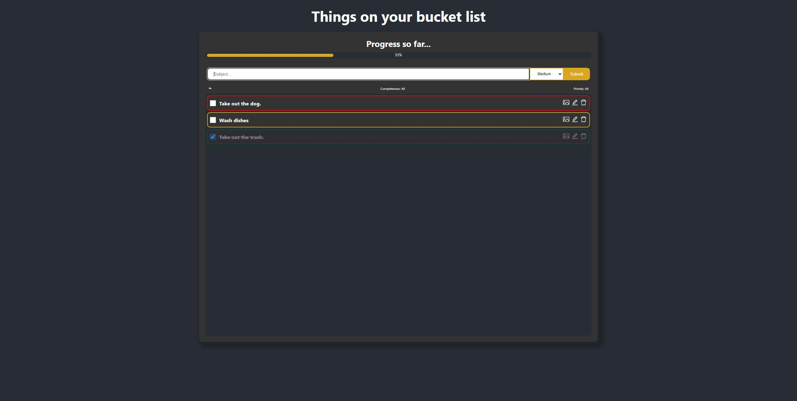
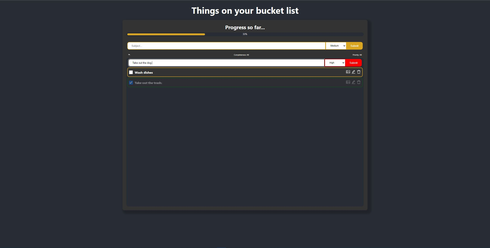

# TODO app
##  A Simple TODO app using React ✨

A simple TODO app that allows you to track your tasks.

- App is deployed on Heroku and you can try it out on link below.
- You can select the priority of the task.
- Every task is editable and deletable
- Tasks are saved on local storage
- You can add an image, that will be displayed as an icon next to the task name and also stored in local storage.
- Every task can be marked as complete
- There are two types of filters that can be applied to filter the tasks.

👉 [TRY IT OUT HERE](https://arcane-tundra-07151.herokuapp.com/) 👈

